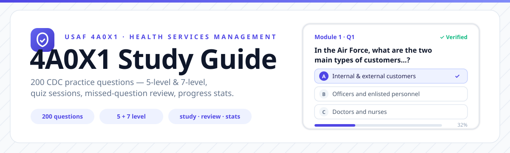
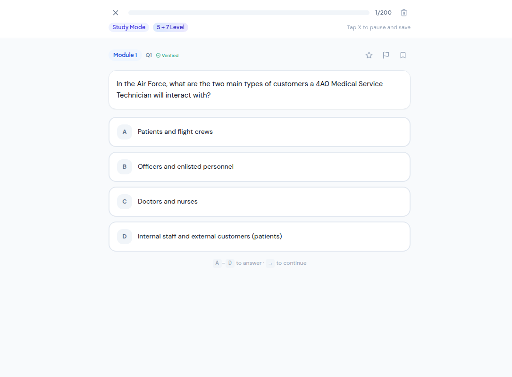

# 4A0X1 Study Guide





A quiz and study app for the Air Force 4A0X1 (Health Services Management) Career Development Courses — 200 practice questions across the 5-level and 7-level CDCs, with quiz sessions, missed-question review, and progress stats.

## Question banks

| Course | Questions | Structure |
|---|---|---|
| CDC 4A051 — Health Services Management Journeyman (5-level) | 150 | 11 modules |
| CDC 4A071N Vol. 1 — Health Services Management Craftsman (7-level) | 50 | 16 lessons |

## Features

- **Quiz sessions** — timed or untimed, by module or mixed
- **Missed-question review** — drill the ones you got wrong until they stick
- **Progress stats** — track scores over time
- **Themes** — light, dark, and system
- **Offline-friendly** — question banks ship with the app

## Run locally

```bash
npm install
npm run dev
```

Production build: `npm run build` (output in `dist/`; the included `netlify.toml` handles SPA routing on Netlify).

## Tech

React 18 + TypeScript + Vite + Tailwind CSS. No backend — all state lives in the browser.

---

*Built by [Hans Sai](https://builtbysai.com) — USAF Reserve, 4A0X1.*
